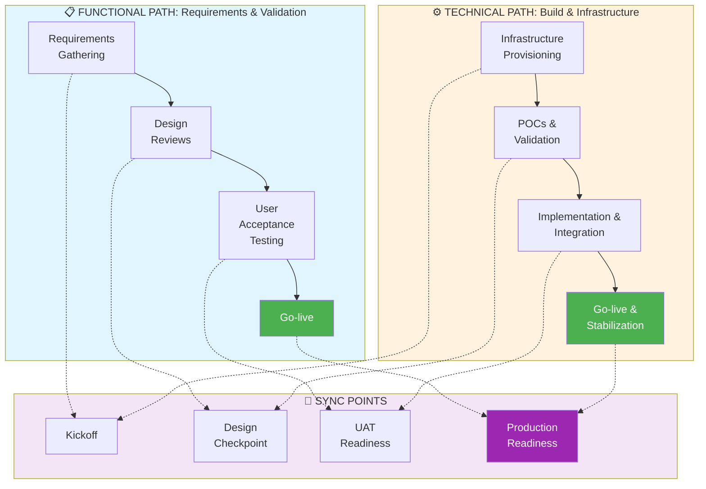

# Platform Modernization Blueprint (Azure + Databricks + dbt)

## Executive Summary

This project demonstrates a **production-ready platform modernization** reference architecture—a blueprint for enterprises transitioning from legacy data systems to cloud-native, scalable analytics platforms. It addresses the critical challenges of reducing latency, standardizing patterns, and enabling self-service analytics for hundreds of stakeholders.

This is both a **technical artifact and a leadership blueprint**, reflecting best practices from driving multi-million-dollar enterprise modernization initiatives.

---

## The Business Case for Modernization

### Why Platforms Fail or Succeed
- **Legacy systems** create bottlenecks: manual processes, slow time-to-insight, tribal knowledge
- **Cloud-native platforms** enable: self-service analytics, real-time decisioning, measurable ROI
- **Success depends on**: proper sequencing of technical and organizational work streams

### Expected Outcomes
✅ **Latency reduction**: Hours → Minutes → Real-time  
✅ **Team enablement**: Specialized teams → Democratized analytics  
✅ **Cost optimization**: Over-provisioned legacy → Right-sized cloud  
✅ **Scalability**: Fixed capacity → Infinite horizontal scaling  

---

## Technology Stack

### Core Platform Components
- **Data Lake**: Azure Data Lake Storage Gen2 (ADLS)
- **Compute**: Azure Databricks (Apache Spark)
- **Orchestration**: Azure Data Factory or Apache Airflow
- **Analytics Engineering**: dbt (data build tool)
- **CI/CD**: GitHub Actions
- **Governance**: Unity Catalog (optional but recommended)

### Architecture Pattern: Medallion (Bronze-Silver-Gold)
```
Raw Data
    ↓
Bronze (Raw, immutable)
    ↓
Silver (Cleaned, deduplicated)
    ↓
Gold (Business-ready, aggregated)
```

---

## Key Components & Artifacts

| Component | Purpose | Location |
|-----------|---------|----------|
| **Spark Ingestion** | Raw data ingestion pipeline (Bronze layer) | `src/ingest_sales_data.py` |
| **dbt Project** | Data transformation & modeling (Silver/Gold) | `dbt_project/` |
| **Azure Implementation** | Databricks notebooks & ADF pipelines | `azure_implementation/` |
| **AWS Implementation** | Lambda & Glue equivalents for comparison | `aws_implementation/` |
| **GCP Implementation** | BigQuery & Dataflow reference | `gcp_implementation/` |
| **CI/CD Workflow** | Automated testing & dbt deployment | `.github/workflows/` |
| **Architecture Diagrams** | Visual reference architectures | `diagrams/` |

---

## How to Run (Local Demo)

### Quick Start
1. Create and activate a virtual environment:
   ```bash
   python -m venv venv
   source venv/bin/activate  # On Windows: venv\Scripts\activate
   ```

2. Install dependencies:
   ```bash
   pip install -r requirements.txt
   ```

3. Run Spark ingestion (Bronze layer):
   ```bash
   python src/ingest_sales_data.py
   ```

4. Run dbt models (Silver/Gold layers):
   ```bash
   dbt run --project-dir dbt_project
   ```

### For Azure Deployment
See `azure_implementation/README.md` for detailed steps to deploy to Databricks.

---

## Strategic Implementation Approach

### The Dual-Path Methodology

Platform modernization is **not a single linear project**—it's two parallel work streams that must stay synchronized:

1. **Left Path (Functional)**: Business requirements → User acceptance → Go-live
2. **Right Path (Technical)**: Infrastructure → Proof of concepts → Implementation → Stabilization

Both paths must converge at go-live, requiring careful stakeholder coordination and risk management.



### Phase Breakdown

#### **Left Path: Functional Stream**

| Phase | Activities | Stakeholders | Outcomes |
|-------|-----------|--------------|----------|
| **Requirements Gathering** | Business workshops, current state assessment, pain points, use cases | Business owners, SMEs, LOB leaders | Requirement document, business case, success metrics |
| **Design Reviews** | Reference architecture presentation, security/compliance review, data governance framework | Architects, Compliance, Business teams | Approved design, risk register, data model |
| **User Acceptance Testing** | UAT environment setup, test case development, end-user testing, feedback incorporation | Business users, QA, Product team | UAT test results, issue resolution, sign-off |
| **Go-live** | Production cutover, documentation, training, support readiness | Operations, Support, Users | Live platform, runbooks, training materials |

#### **Right Path: Technical Stream**

| Phase | Activities | Stakeholders | Outcomes |
|-------|-----------|--------------|----------|
| **Infrastructure Provisioning** | Cloud resource setup, networking, security groups, storage, compute | DevOps, Cloud architects | IaaS running, networking validated, cost baselines |
| **POCs & Validation** | Prototype data pipelines, test Spark/dbt, performance validation, cost modeling | Data engineers, Analytics engineers | Proof of spike architecture, benchmark results, cost estimates |
| **Implementation & Integration** | Full pipeline development, dbt implementation, orchestration setup, monitoring/alerting | Data engineers, DE, Platform eng | Production-ready code, deployment pipelines, monitoring |
| **Go-live & Stabilization** | Production deployment, performance monitoring, issue resolution, optimization | DevOps, Support, Data eng | Stable platform, SLAs met, cost optimized, incidents closed |

---

## Key Decision Points & Trade-offs

When modernizing your platform, consider:

### Cloud Provider Selection
- **Azure + Databricks**: First-class integration, Synapse Analytics alternative
- **AWS**: Most mature ecosystem (Glue, Athena, Redshift), largest market share
- **GCP**: BigQuery simplicity, strong ML/AI services
- **Multi-cloud**: Complexity increases 3x, avoid unless mandated

### Compute Engine
- **Spark**: Flexible, multi-language, large ecosystem (Databricks, EMR, Dataproc)
- **Presto/Trino**: Federated queries, multiple sources (good for heterogeneous environments)
- **Native DW** (Redshift/Synapse/BigQuery): Simplicity, performance, vendor lock-in

### Orchestration
- **Orchestration-first** (Airflow): Complex DAGs, dynamic workflows
- **Transformation-first** (dbt): Simple, version-controlled SQL
- **Hybrid**: dbt + lightweight orchestrator (Airflow, Prefect, Dagster)

### Data Governance
- **Minimal**: Just keep lineage & documentation clean
- **Standards-heavy**: Catalog, quality rules, access controls
- **Lakehouse-native**: Unity Catalog (Databricks), Iceberg (multi-platform)

---

## Presentation Ready: Key Talking Points

1. **The Modernization Journey**: Three phases (assess, migrate, optimize) spanning 12-24 months
2. **Technical Debt Payoff**: Legacy → Cloud = 40-60% operational cost reduction
3. **Team Empowerment**: From "data requests submitted" → "self-service analytics"
4. **Risk Management**: Parallel path syncing prevents go-live failures
5. **Business Impact**: Real-time insights → faster decisions → competitive advantage

---

## Repository Structure

```
01_platform_modernization_blueprint/
├── README.md                          ← You are here
├── architecture_config.py             ← Config-driven architecture
├── aws_implementation/                ← AWS reference (Lambda, Glue, Athena)
├── azure_implementation/              ← Azure implementation (Databricks, ADF)
├── gcp_implementation/                ← GCP reference (BigQuery, Dataflow)
├── dbt_project/                       ← dbt models (transformations)
├── src/                               ← Spark ingestion code
├── data/                              ← Sample datasets
├── diagrams/                          ← Architecture diagrams
└── scripts/                           ← Utility scripts
```

---

## Advanced Topics

- **Incremental Data Loading**: Handling full vs. delta processing
- **Data Quality Frameworks**: Great Expectations integration (see `02_data_quality_framework/`)
- **Performance Optimization**: Partitioning, clustering, caching strategies
- **Cost Optimization**: Spot instances, auto-scaling, tiered storage
- **Security & Compliance**: Unity Catalog, encryption, audit logging

---

## Next Steps

1. **Assess your current state**: Legacy systems, team skills, cloud readiness
2. **Define success metrics**: Cost, latency, data freshness, team satisfaction
3. **Sequence the work**: Functional + Technical paths, sync points every 4 weeks
4. **Start small**: One use case, one data flow, prove the pattern
5. **Scale systematically**: Replicate the winning pattern, train the platform team

---

## Reference & Resources

- **dbt Documentation**: https://docs.getdbt.com
- **Azure Databricks**: https://learn.microsoft.com/en-us/azure/databricks
- **Data Engineering on Lakehouse**: Modern, cloud-native architectures
- **DataOps Principles**: Automation, testing, monitoring all the way down
- **My Experience**: Leading teams through 10+ major platform modernizations

---

## License

See [LICENSE](../LICENSE) for details.
