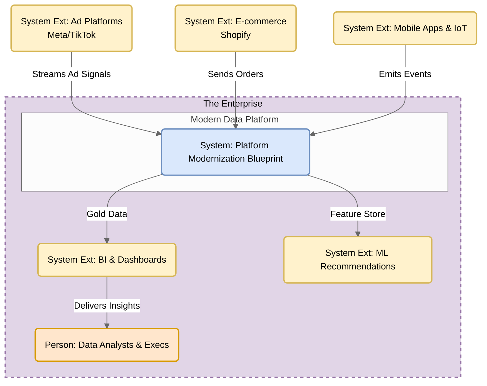

# AWS Module: Global Omni-Channel Attribution Lakehouse

## 1. Executive Summary & Problem Statement
**The Challenge:** Marketing data is "messy" and high-velocity, while financial data is strict and transactional. Bridging this gap to calculate Real-Time ROAS (Return on Ad Spend) is difficult.
**The Solution:** A Serverless Attribution Lakehouse using AWS Glue.

## 2. Medallion Architecture Implementation
* **Bronze:** Raw ingestion of Ad Impressions and Orders from S3.
* **Silver:** Type enforcement (Timestamps) and Data Quality checks (Null SKU removal).
* **Gold:** Stateful temporal join to link specific Ad Impressions to Orders, aggregated by Campaign ID.

### System Context Diagram: Platform Modernization Blueprint

## 3. How to Run
1.  `cd aws_implementation`
2.  `python glue_etl_job.py`
