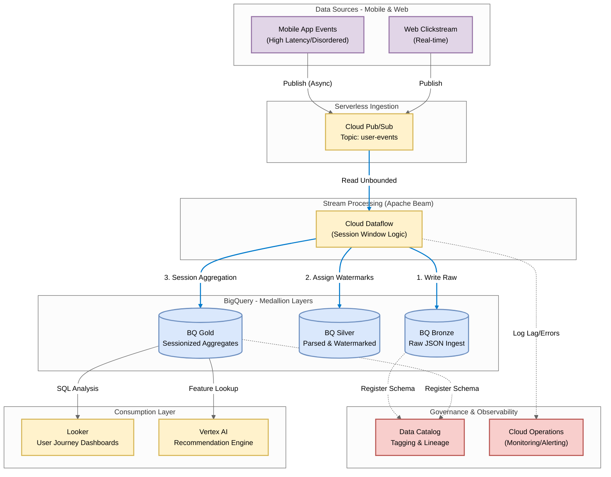

# GCP Module: Serverless Streaming User Analytics

## 1. Executive Summary & Problem Statement
**The Challenge:** Mobile connectivity issues cause "Late Data," breaking traditional session metrics.
**The Solution:** Google Cloud Dataflow with Watermark handling.

## 2. Medallion Architecture Implementation
* **Bronze:** Raw JSON strings from Pub/Sub.
* **Silver:** Parsed objects with "Event Time" assigned (handling the 'late arrival' problem).
* **Gold:** Dynamic Session Windows that re-sequence the disordered events into accurate user journeys.

### GCP Architecture: Serverless Streaming Analytics

## 3. How to Run
1.  `cd gcp_implementation`
2.  `python dataflow_pipeline.py`
