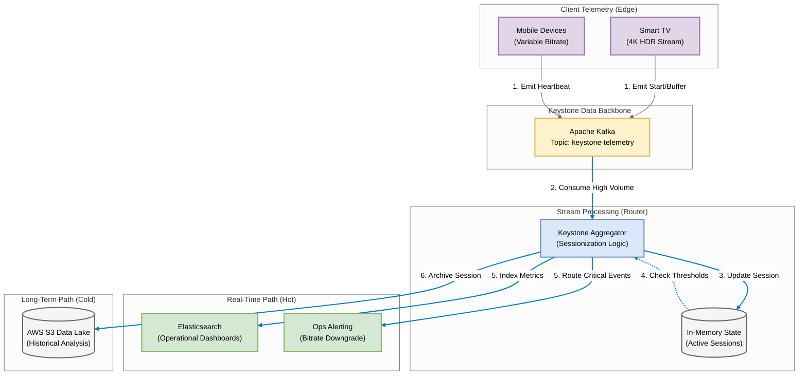

# Netflix Keystone: Real-Time Data Backbone

## 1. Problem Statement
With 200M+ users, Netflix cannot wait for overnight batch jobs to know if playback is failing. We need a real-time 'Keystone' pipeline to ingest telemetry (Start, Stop, Buffer) and instantly detect Quality of Experience (QoE) issues per region or device.

## 2. Requirements & KPIs
- High Throughput: Ingest millions of events/second (Heartbeats, Errors).
- Sessionization: Correlate 'Start', 'Buffer', and 'Stop' events into a single viewing session.
- Latency: Detect buffering loops in < 3 seconds.
- Routing: Route data to both Real-time Dashboards (Elasticsearch) and Data Lake (S3).

## 3. Architecture & Pipeline
1. **Edge (Producer)**: Devices emit telemetry events (JSON).
2. **Ingest**: Kafka Topic `keystone-telemetry`.
3. **Processing (Consumer)**: 
   - Maintains 'Active Session' state in memory.
   - Counts 'Buffer' events per user.
4. **Action**: Triggers 'Bitrate Downgrade' alerts if buffering exceeds thresholds.

---

## 4. Technical Implementation

### File Structure
- `producer.py`: Simulates millions of devices sending playback telemetry.
- `consumer.py`: The Keystone Aggregator. It sessionizes events to calculate view time and buffering.
- `utils_logger.py`: High-performance logging config.

### Architecture Diagram: Netflix Keystone Pipeline




### How to Run this Demo

**Step 1: Install Dependencies**
```bash
pip install -r requirements.txt
```

**Step 2: Start the Analytics Engine (Consumer)**
This service watches the stream for quality issues.
```bash
python consumer.py
```
*It will simulate a user session where buffering gets critical...*

**Step 3: Start the Traffic Generator (Producer)**
This generates random traffic (Starts, Stops, Heartbeats).
```bash
python producer.py
```

**Step 4: Observe Real-Time QoE**
Watch the Consumer terminal. You will see:
- ▶️ **START**: User began a session.
- ⚠️ **BUFFERING**: Warning logs as lag increases.
- 🚨 **CRITICAL QoE ALERT**: Triggered when a user buffers 3x in a row.
- ⏹️ **STOP**: Calculates total viewing duration when session ends.

---
*Generated by Automation Script | Netflix Keystone: Real-Time Data Backbone Project*
