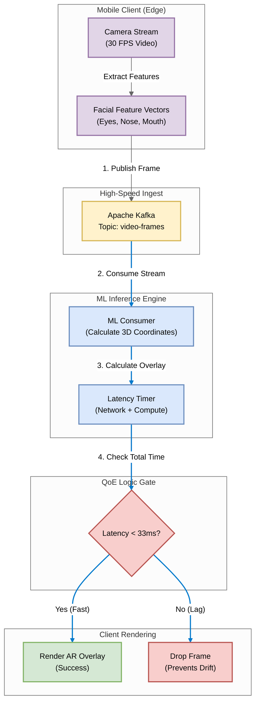

# Snapchat: Real-Time ML & Augmented Reality

## 1. Problem Statement
Augmented Reality (AR) filters (like dog ears) must 'stick' to a user's face perfectly. If the processing pipeline takes longer than 33 milliseconds (1 frame at 30fps), the filter 'drifts' behind the face, breaking the immersion. We need an ultra-low latency streaming pipeline for ML inference.

## 2. Requirements & KPIs
- Hard Real-Time Constraint: Total round-trip time < 33ms.
- Throughput: Handle video feature vectors from millions of active users.
- Fallibility: It is better to DROP a late frame than to render it late (prevents motion sickness).
- Pipeline: Camera -> Feature Extraction -> Stream -> ML Model -> Coordinate Response.

## 3. Architecture & Pipeline
1. **Client (Producer)**: Captures video, extracts facial landmarks (eyes, nose), sends JSON stream.
2. **Transport**: Kafka (or UDP/gRPC in extreme cases) for high-speed ingest.
3. **Inference (Consumer)**: 
   - Calculates 3D position for the AR asset.
   - Checks Total Latency (Network + Compute).
4. **Render**: If Latency < 33ms, send coordinates back to phone. Else, discard.

---

## 4. Technical Implementation

### File Structure
- `producer.py`: Simulates the Camera sending facial landmark vectors (30 FPS).
- `consumer.py`: The ML Inference Engine. Includes logic to measure lag and drop frames.
- `utils_logger.py`: Configured for millisecond-precision logging.

### Architecture Diagram: Snapchat Real-Time AR Pipeline




### How to Run this Demo

**Step 1: Install Dependencies**
```bash
pip install -r requirements.txt
```

**Step 2: Start the ML Engine (Consumer)**
This service acts as the backend processor calculating AR coordinates.
```bash
python consumer.py
```
*The engine will start waiting for video frames...*

**Step 3: Start the Camera Stream (Producer)**
This simulates a user opening Snapchat and moving their head.
```bash
python producer.py
```

**Step 4: Observe Latency & Drift**
Watch the Consumer terminal. You will see two types of logs:
- ✨ **Rendered Frame**: Success! Processing was fast enough (<33ms).
- ⚠️ **LAG DETECTED**: Failure! The simulated ML model spiked in time, causing the frame to be dropped to prevent "drift."

This demonstrates the "Hard Real-Time" nature of AR streaming.

---
*Generated by Automation Script | Snapchat: Real-Time ML & Augmented Reality Project*
