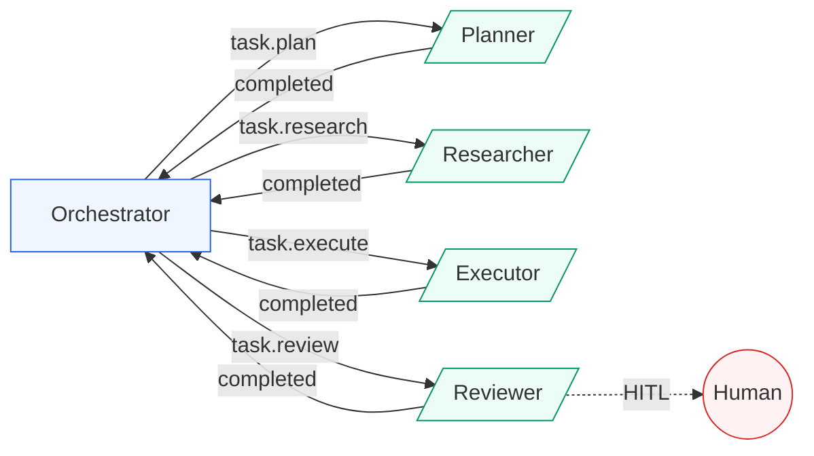

# Multi-Agent Task Orchestration System

An event-driven multi-agent pipeline where specialized agents (Planner, Researcher, Executor, Reviewer) collaborate on complex tasks via a pub/sub event bus, MCP-style tool registry, and human-in-the-loop checkpoint gates.

---

## Architecture



See [`diagrams/architecture.md`](diagrams/architecture.md) for detailed architecture and sequence diagrams.

---

## Problem Statement

Complex tasks like code review, research synthesis, and automated analysis require multiple specialized capabilities working in sequence. Monolithic systems that try to do everything in one pass are hard to compose, hard to debug, and leave no natural points for human oversight.

This system solves that by decomposing work into an agent pipeline where each agent is a single-purpose component, agents communicate through events (not direct calls), and configurable checkpoints allow human review before critical decisions.

---

## Key Features

| Feature | Description |
|---------|-------------|
| **Event-Driven Architecture** | Agents communicate via pub/sub event bus, no direct coupling |
| **MCP Tool Registry** | Tools registered with JSON schema definitions, validated inputs, full call logging |
| **State Management** | Centralized state with snapshot/restore, mutation audit trail |
| **HITL Checkpoints** | Configurable pause points for human review (approve/reject/modify) |
| **Modular Agents** | Single-purpose, composable via YAML config. Add or remove agents without code changes |
| **Sandboxed Execution** | Code tool runs in restricted namespace with limited builtins |

---

## Tech Stack

| Component | Technology |
|-----------|-----------|
| Language | Python 3.10+ |
| Event Bus | Custom pub/sub (extensible to Redis/RabbitMQ) |
| Tool Protocol | MCP-style JSON schema registration |
| Search | TF-IDF (extensible to vector store / Azure AI Search) |
| Config | YAML pipeline definitions |
| Testing | pytest |

---

## Quick Start

```bash
# Clone and navigate
git clone https://github.com/Taash1M/Taashi_Github.git
cd Taashi_Github/18_multi_agent_orchestration

# Install dependencies
pip install -r requirements.txt

# Run the code review pipeline example
python examples/code_review_pipeline.py

# Run the research pipeline example
python examples/research_pipeline.py

# Run tests
python -m pytest tests/ -v
```

---

## Sample Output

```
============================================================
Multi-Agent Code Review Pipeline
============================================================

Starting code review pipeline...
----------------------------------------

PIPELINE RESULTS
============================================================
Task: Review the authentication module for security issues...
Success: True
Duration: 0.01s
Events processed: 8
Final status: reviewed

Stage Results:
  [PLAN] PASS
    Step 1: Read source files (researcher)
    Step 2: Analyze code quality (executor)
    Step 3: Generate review report (executor)
    Step 4: Validate findings (reviewer)
  [RESEARCH] PASS
  [EXECUTE] PASS
  [REVIEW] PASS
    [+] execution_complete
    [+] output_exists
    [+] no_errors

State Summary:
  State keys: 9
  Snapshots: ['initial', 'pre_review', 'final']
  Total mutations: 12
```

---

## Project Structure

```
18_multi_agent_orchestration/
├── src/
│   ├── orchestrator.py              # Pipeline controller
│   ├── agents/
│   │   ├── base_agent.py            # Abstract agent with lifecycle management
│   │   ├── planner_agent.py         # Task decomposition
│   │   ├── researcher_agent.py      # Information gathering via tools
│   │   ├── executor_agent.py        # Code generation and execution
│   │   └── reviewer_agent.py        # Quality gate with HITL
│   ├── tools/
│   │   ├── tool_registry.py         # MCP-style tool registration
│   │   ├── file_tool.py             # File operations (sandboxed)
│   │   ├── search_tool.py           # TF-IDF knowledge retrieval
│   │   └── code_tool.py             # Sandboxed code execution
│   ├── core/
│   │   ├── event_bus.py             # Pub/sub message passing
│   │   ├── state_manager.py         # Shared state with audit trail
│   │   └── checkpoint.py            # HITL checkpoint gates
│   └── config/
│       └── pipeline_config.yaml     # Pipeline definition
├── examples/
│   ├── code_review_pipeline.py      # Code review demo
│   └── research_pipeline.py         # Research synthesis demo
├── tests/                           # 33 tests, all passing
├── notebooks/                       # Interactive walkthrough
├── diagrams/                        # Architecture diagrams
└── docs/                            # Design decisions
```

---

## Design Decisions

- **Event bus over direct calls:** agents are decoupled and composable through config, not code
- **MCP tool protocol:** standard interfaces for tool discovery and invocation
- **Mock LLM responses:** shows architecture patterns without requiring API keys
- **Single-process synchronous:** simple to demo; event bus interface supports async/distributed extension

See [`docs/design_decisions.md`](docs/design_decisions.md) for full rationale.

---

## Extension Points

| What | How |
|------|-----|
| Add real LLM | Replace mock responses in agent `execute()` with Azure OpenAI / Claude API calls |
| Add vector search | Swap `KnowledgeBase` TF-IDF with FAISS, Chroma, or Azure AI Search |
| Distributed execution | Replace synchronous event dispatch with Redis pub/sub or Azure Service Bus |
| New agent type | Extend `BaseAgent`, define subscriptions, register with orchestrator |
| New tool | Create `ToolDefinition` with handler, register in `ToolRegistry` |
| Custom pipeline | Edit `pipeline_config.yaml` to change stage order, agents, checkpoints |
