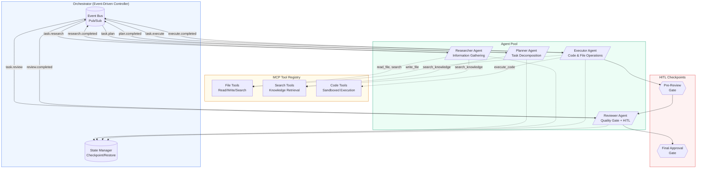
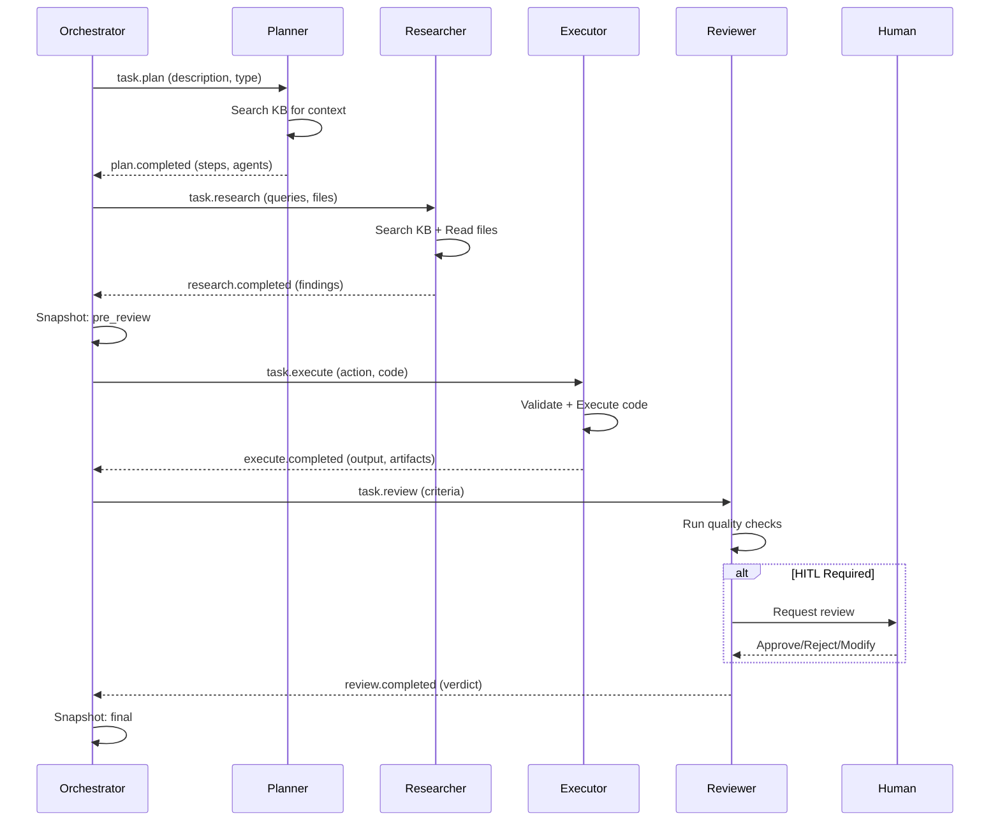

# Architecture Diagram

```mermaid
graph TB
    subgraph Orchestrator["Orchestrator (Event-Driven Controller)"]
        direction TB
        EB[("Event Bus<br/>Pub/Sub")]
        SM[("State Manager<br/>Checkpoint/Restore")]
    end

    subgraph Agents["Agent Pool"]
        PA[/"Planner Agent<br/>Task Decomposition"/]
        RA[/"Researcher Agent<br/>Information Gathering"/]
        EA[/"Executor Agent<br/>Code & File Operations"/]
        VA[/"Reviewer Agent<br/>Quality Gate + HITL"/]
    end

    subgraph Tools["MCP Tool Registry"]
        FT["File Tools<br/>Read/Write/Search"]
        ST["Search Tools<br/>Knowledge Retrieval"]
        CT["Code Tools<br/>Sandboxed Execution"]
    end

    subgraph Checkpoints["HITL Checkpoints"]
        CP1{{"Pre-Review<br/>Gate"}}
        CP2{{"Final Approval<br/>Gate"}}
    end

    %% Event flow
    EB -->|task.plan| PA
    EB -->|task.research| RA
    EB -->|task.execute| EA
    EB -->|task.review| VA

    PA -->|plan.completed| EB
    RA -->|research.completed| EB
    EA -->|execute.completed| EB
    VA -->|review.completed| EB

    %% Tool usage
    PA -.->|search_knowledge| ST
    RA -.->|read_file, search| FT
    RA -.->|search_knowledge| ST
    EA -.->|execute_code| CT
    EA -.->|write_file| FT

    %% State access
    PA -.-> SM
    RA -.-> SM
    EA -.-> SM
    VA -.-> SM

    %% Checkpoints
    EA --> CP1 --> VA
    VA --> CP2

    style Orchestrator fill:#eff6ff,stroke:#2563eb
    style Agents fill:#ecfdf5,stroke:#059669
    style Tools fill:#fffbeb,stroke:#d97706
    style Checkpoints fill:#fef2f2,stroke:#dc2626
```

## Pipeline Flow

```mermaid
sequenceDiagram
    participant O as Orchestrator
    participant P as Planner
    participant R as Researcher
    participant E as Executor
    participant V as Reviewer
    participant H as Human

    O->>P: task.plan (description, type)
    P->>P: Search KB for context
    P-->>O: plan.completed (steps, agents)

    O->>R: task.research (queries, files)
    R->>R: Search KB + Read files
    R-->>O: research.completed (findings)

    O->>O: Snapshot: pre_review

    O->>E: task.execute (action, code)
    E->>E: Validate + Execute code
    E-->>O: execute.completed (output, artifacts)

    O->>V: task.review (criteria)
    V->>V: Run quality checks
    
    alt HITL Required
        V->>H: Request review
        H-->>V: Approve/Reject/Modify
    end
    
    V-->>O: review.completed (verdict)
    O->>O: Snapshot: final
```
