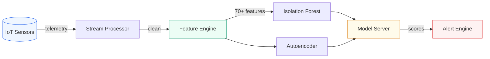

# IoT Sensor Anomaly Detection Pipeline

End-to-end ML pipeline for detecting anomalies in industrial IoT sensor telemetry from mining equipment. Processes data from 50 machines across 5 remote sites using Isolation Forest and Autoencoder models with real-time alerting.

---

## Architecture



See [`diagrams/architecture.md`](diagrams/architecture.md) for detailed architecture and feature pipeline diagrams.

---

## Problem Statement

Industrial equipment in mining operations generates continuous sensor telemetry (temperature, vibration, pressure, RPM, power). Detecting anomalies early, whether bearing degradation, sudden failures, or sensor malfunctions, prevents costly downtime and safety incidents. Traditional threshold-based monitoring misses gradual drift and complex multi-sensor patterns.

This pipeline uses unsupervised ML to learn normal equipment behavior and flag deviations, combining fast interpretable models (Isolation Forest) with pattern-learning models (Autoencoder).

---

## Key Features

| Feature | Description |
|---------|-------------|
| **Streaming Ingestion** | Batch-simulated streaming with schema validation and quality checks |
| **Feature Engineering** | Rolling stats (3 windows), rate of change, cross-sensor correlations, lag features, FFT |
| **Dual Model Approach** | Isolation Forest (fast, interpretable) + Autoencoder (complex patterns) |
| **Model Serving** | Versioned model registry with health checks and prediction logging |
| **Alert Engine** | Severity classification (INFO/WARNING/CRITICAL), cooldown periods, routing config |
| **Synthetic Data** | Realistic mining equipment telemetry with injected anomaly types |

---

## Tech Stack

| Component | Technology |
|-----------|-----------|
| Language | Python 3.10+ |
| ML Models | scikit-learn (Isolation Forest), NumPy (Autoencoder) |
| Feature Engineering | pandas, NumPy, FFT |
| Data Validation | Custom schema validator |
| Alerting | YAML-configurable rule engine |
| Testing | pytest (25 tests) |

---

## Quick Start

```bash
# Clone and navigate
git clone https://github.com/Taash1M/Taashi_Github.git
cd Taashi_Github/19_iot_anomaly_detection

# Install dependencies
pip install -r requirements.txt

# Generate sample sensor data (50K rows, 5 machines)
python data/generate_sensor_data.py --sample

# Run the full pipeline
python -c "
import sys; sys.path.insert(0, '.')
from src.pipeline import run_pipeline
result = run_pipeline('data/sensor_data_sample.csv')
print(f'Anomalies detected: {result[\"anomalies_detected\"]}')
print(f'Alerts generated: {result[\"alert_summary\"][\"total_alerts\"]}')
"

# Run tests
python -m pytest tests/ -v
```

---

## Sample Output

```
Step 1: Ingesting and validating data...
  Valid records: 50,400 (rejected: 0)
Step 2: Engineering features...
  Features: 70, Samples: 50,400
Step 3: Training anomaly detection models...
  Isolation Forest: trained
  Autoencoder: trained
Step 4: Running anomaly detection...
  IF - Precision: 0.412, Recall: 0.687, F1: 0.515
  AE - Precision: 0.238, Recall: 0.531, F1: 0.329
Step 5: Generating alerts...
  Generated 42 alerts ({'info': 18, 'warning': 15, 'critical': 9})

Pipeline complete in 8.34s
```

---

## Synthetic Data

Generated by `data/generate_sensor_data.py`:

| Parameter | Value |
|-----------|-------|
| Machines | 50 (full) / 5 (sample) |
| Sites | 5 remote mining locations |
| Sensors | temperature, vibration, pressure, RPM, power |
| Time Range | 30 days at 1-minute intervals |
| Anomaly Types | Bearing degradation (drift), sudden failure (spike), sensor malfunction |
| Total Rows | ~2.16M (full) / ~50K (sample) |

---

## Project Structure

```
19_iot_anomaly_detection/
├── data/
│   ├── generate_sensor_data.py      # Synthetic data generator
│   ├── sensor_data_sample.csv       # Sample dataset
│   └── equipment_registry.csv       # Machine metadata
├── src/
│   ├── pipeline.py                  # End-to-end orchestration
│   ├── ingestion/
│   │   ├── stream_processor.py      # Batch streaming simulation
│   │   └── data_validator.py        # Schema + quality validation
│   ├── features/
│   │   ├── feature_engine.py        # Rolling stats, FFT, correlations
│   │   └── feature_store.py         # Versioned feature storage
│   ├── models/
│   │   ├── isolation_forest.py      # Unsupervised anomaly detection
│   │   ├── autoencoder.py           # NumPy autoencoder (no PyTorch needed)
│   │   └── model_server.py          # Serving with health checks
│   └── alerting/
│       ├── alert_engine.py          # Severity classification + routing
│       └── alert_config.yaml        # Threshold configuration
├── tests/                           # 25 tests, all passing
├── notebooks/                       # Interactive walkthroughs
└── diagrams/                        # Architecture diagrams
```

---

## Design Decisions

- **Dual model approach:** Isolation Forest catches point anomalies quickly; Autoencoder captures complex multi-sensor patterns. Ensemble scoring is possible.
- **NumPy-only autoencoder:** No PyTorch/TensorFlow dependency. Pure NumPy with manual backprop. Portable, fast to install, and shows understanding of the underlying math.
- **Feature engineering over raw data:** 70+ engineered features from 5 raw sensors. Rolling statistics over multiple windows capture temporal context. FFT captures periodic degradation patterns.
- **Configurable alerting:** YAML-driven thresholds, severity levels, and cooldown periods. Equipment-specific overrides for critical machinery.

---

## Extension Points

| What | How |
|------|-----|
| Real streaming | Replace `StreamProcessor` with Kafka/Event Hubs consumer |
| Vector feature store | Swap `FeatureStore` with Feast or Azure ML Feature Store |
| Deep learning | Replace `SimpleAutoencoder` with PyTorch LSTM-Autoencoder for sequence modeling |
| Production serving | Wrap `ModelServer` with FastAPI, deploy on Azure ML managed endpoints |
| Real-time dashboard | Stream alerts to Grafana or Power BI via webhook |
