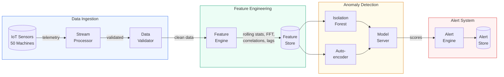
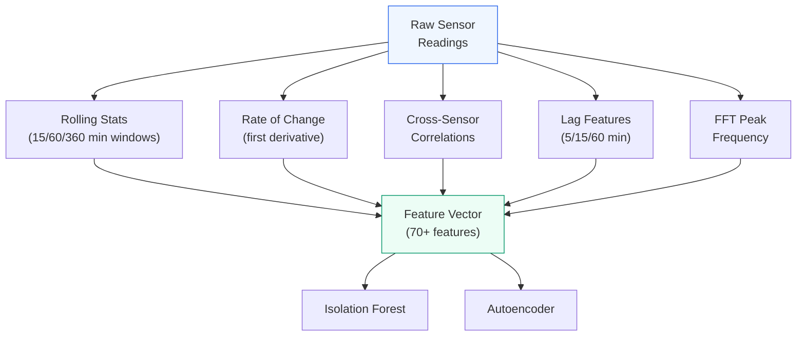

# Architecture Diagram

```mermaid
graph LR
    subgraph Ingestion["Data Ingestion"]
        S1[("IoT Sensors<br/>50 Machines")]
        SP["Stream<br/>Processor"]
        DV["Data<br/>Validator"]
    end

    subgraph Features["Feature Engineering"]
        FE["Feature<br/>Engine"]
        FS[("Feature<br/>Store")]
    end

    subgraph Models["Anomaly Detection"]
        IF["Isolation<br/>Forest"]
        AE["Auto-<br/>encoder"]
        MS["Model<br/>Server"]
    end

    subgraph Alerting["Alert System"]
        AEN["Alert<br/>Engine"]
        DB[("Alert<br/>Store")]
    end

    S1 -->|telemetry| SP
    SP -->|validated| DV
    DV -->|clean data| FE
    FE -->|rolling stats, FFT,<br/>correlations, lags| FS
    FS --> IF
    FS --> AE
    IF --> MS
    AE --> MS
    MS -->|scores| AEN
    AEN --> DB

    style Ingestion fill:#eff6ff,stroke:#2563eb
    style Features fill:#ecfdf5,stroke:#059669
    style Models fill:#fffbeb,stroke:#d97706
    style Alerting fill:#fef2f2,stroke:#dc2626
```

## Feature Engineering Pipeline

```mermaid
graph TD
    RAW["Raw Sensor<br/>Readings"] --> RS["Rolling Stats<br/>(15/60/360 min windows)"]
    RAW --> ROC["Rate of Change<br/>(first derivative)"]
    RAW --> CC["Cross-Sensor<br/>Correlations"]
    RAW --> LAG["Lag Features<br/>(5/15/60 min)"]
    RAW --> FFT["FFT Peak<br/>Frequency"]

    RS --> FV["Feature Vector<br/>(70+ features)"]
    ROC --> FV
    CC --> FV
    LAG --> FV
    FFT --> FV

    FV --> IF["Isolation Forest"]
    FV --> AE["Autoencoder"]

    style RAW fill:#eff6ff,stroke:#2563eb
    style FV fill:#ecfdf5,stroke:#059669
```
