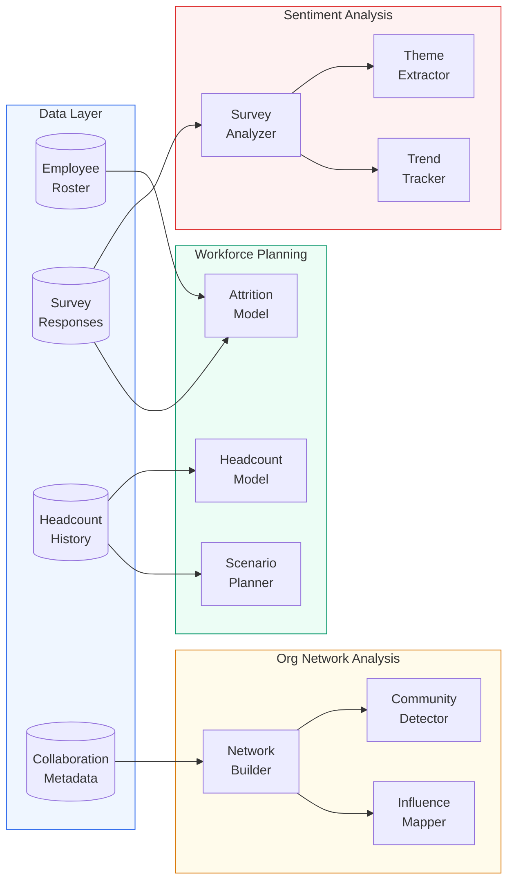

# People Analytics NLP Suite

Unified analytics platform for data-driven workforce decisions. Three modules, **NLP sentiment analysis**, **headcount forecasting**, and **organizational network analysis**, processing 5,000-employee synthetic HR data with survey responses, collaboration metadata, and 36 months of headcount history.

---

## Architecture



See [`diagrams/architecture.md`](diagrams/architecture.md) for detailed module flows and Azure production architecture.

---

## Problem Statement

HR organizations generate massive volumes of data (survey responses, headcount records, collaboration metadata) but lack the tooling to extract useful patterns at scale. Traditional approaches rely on manual spreadsheet analysis, missing cross-cutting signals like:

- Sentiment divergence between departments invisible in Likert averages
- Attrition risk signals hidden in the intersection of engagement scores and tenure
- Collaboration silos that formal org charts don't reveal

This suite applies NLP, time series forecasting, and network science to surface these patterns programmatically.

---

## Key Features

| Module | Capabilities |
|--------|-------------|
| **Sentiment Analysis** | Custom HR-tuned VADER sentiment, LDA topic modeling, trend tracking with shift detection |
| **Headcount Forecasting** | Trend-seasonal decomposition, Holt exponential smoothing, attrition risk prediction, scenario planning |
| **Org Network Analysis** | Collaboration network construction, spectral community detection, centrality-based influence mapping |
| **Visualization** | Polished charts: heatmaps, forecast plots with CIs, network graphs, influence maps |

---

## Tech Stack

| Component | Technology |
|-----------|-----------|
| Language | Python 3.10+ |
| NLP | Custom lexicon-based VADER, sklearn LDA |
| Forecasting | NumPy (trend-seasonal, Holt's), sklearn (logistic regression) |
| Network Analysis | NumPy (centrality metrics, Floyd-Warshall), sklearn (spectral clustering) |
| Visualization | matplotlib |
| Testing | pytest (33 tests) |

---

## Quick Start

```bash
# Clone and navigate
git clone https://github.com/Taash1M/Taashi_Github.git
cd Taashi_Github/20_people_analytics_nlp

# Install dependencies
pip install -r requirements.txt

# Generate synthetic HR data (5,000 employees)
python data/generate_hr_data.py

# Run the full pipeline
python -c "
import sys; sys.path.insert(0, '.')
from src.pipeline import run_pipeline
result = run_pipeline('data/')
print(f'Sentiment: {result[\"sentiment\"][\"responses_analyzed\"]:,} responses analyzed')
print(f'Forecasting: {result[\"forecasting\"][\"departments_forecast\"]} departments forecast')
print(f'ONA: {result[\"ona\"][\"communities\"]} communities, {result[\"ona\"][\"silos_detected\"]} silos')
"

# Run tests
python -m pytest tests/ -v
```

For smaller dataset (1,000 employees): `python data/generate_hr_data.py --small`

---

## Sample Output

```
============================================================
People Analytics Pipeline
============================================================

Loading data...
  Loaded employees.csv: 5,000 rows
  Loaded survey_responses.csv: 10,885 rows
  Loaded headcount_history.csv: 288 rows
  Loaded collaboration_data.csv: 50,000 rows

--- Module 1: Sentiment Analysis ---
  Analyzed 10,885 responses
  Departments: 8
  Themes discovered: 6
  Trend alerts: 0
  Concerning responses: 251

--- Module 2: Headcount Forecasting ---
  Forecasts generated: 16 (8 departments)
  High-risk employees: 0
  Scenarios compared: 4

--- Module 3: Organizational Network Analysis ---
  Network: 8 nodes, 56 edges
  Density: 1.000, Cross-dept: 25.4%
  Communities: 3, Silos detected: 1
  Top connectors: Engineering, Sales, Product

============================================================
Pipeline complete in 17.76s
============================================================
```

---

## Synthetic Data

Generated by `data/generate_hr_data.py`:

| Dataset | Records | Description |
|---------|---------|-------------|
| Employee Roster | 5,000 | 8 departments, 4 levels, 5 locations, demographics |
| Survey Responses | 10,885 | 3 quarterly surveys, Likert (1-5) + free-text comments |
| Headcount History | 288 | 36 months x 8 departments, with seasonality and attrition spikes |
| Collaboration Data | 50,000 | Email/meeting/chat metadata with 70/30 intra/cross-dept split |

All data is synthetic. No PII. Safe for public GitHub.

---

## Module Details

### 1. Sentiment Analysis (`src/sentiment/`)

- **Survey Analyzer:** Custom VADER-inspired engine with HR-specific lexicon (60+ workplace terms), negation handling, intensifier/diminisher modifiers. Outputs per-response compound scores [-1, 1] and labels.
- **Theme Extractor:** LDA topic modeling on free-text survey responses. Discovers themes invisible in Likert scores (e.g., "tools frustration" may not correlate with any standard survey question). Auto-labels themes using keyword matching.
- **Trend Tracker:** Period-over-period sentiment shifts with significance detection. Identifies departments whose sentiment trajectory diverges from the org mean.

### 2. Headcount Forecasting (`src/forecasting/`)

- **Headcount Model:** Two approaches: linear trend + seasonal decomposition (captures hiring seasonality) and Holt's exponential smoothing (adapts to recent changes). Both produce confidence intervals that widen with forecast horizon.
- **Attrition Model:** Logistic regression on tenure, engagement scores, level, demographics. Chosen over gradient boosting for interpretability: feature coefficients map directly to "why is this person at risk?"
- **Scenario Planner:** What-if simulations: attrition spike (+20%), hiring freeze, rapid growth, economic downturn. Applies scenario parameters to historical hiring/departure rates and projects 12-month headcount.

### 3. Organizational Network Analysis (`src/ona/`)

- **Network Builder:** Constructs department-level collaboration graphs from interaction metadata. Adjacency matrix weighted by interaction frequency.
- **Community Detector:** Spectral clustering identifies natural collaboration clusters. Silo detection flags communities with disproportionately high internal vs. external interaction ratios.
- **Influence Mapper:** Degree, betweenness, and eigenvector centrality metrics. Classifies departments as connectors (bridge silos), hubs (high volume), bottlenecks (single points of failure), or peripheral.

---

## Project Structure

```
20_people_analytics_nlp/
├── data/
│   ├── generate_hr_data.py          # Synthetic data generator
│   ├── employees.csv                # Employee roster
│   ├── survey_responses.csv         # Survey responses with free text
│   ├── headcount_history.csv        # 36 months of headcount
│   └── collaboration_data.csv       # Email/meeting/chat metadata
├── src/
│   ├── sentiment/
│   │   ├── survey_analyzer.py       # NLP sentiment analysis
│   │   ├── theme_extractor.py       # LDA topic modeling
│   │   └── trend_tracker.py         # Sentiment trend detection
│   ├── forecasting/
│   │   ├── headcount_model.py       # Time series forecasting
│   │   ├── attrition_model.py       # Attrition risk prediction
│   │   └── scenario_planner.py      # What-if scenario modeling
│   ├── ona/
│   │   ├── network_builder.py       # Collaboration network construction
│   │   ├── community_detector.py    # Cluster and silo detection
│   │   └── influence_mapper.py      # Centrality-based influence scoring
│   ├── dashboard/
│   │   └── visualizations.py        # Publication-quality charts
│   └── pipeline.py                  # Unified analytics pipeline
├── tests/                           # 33 tests, all passing
├── notebooks/                       # Interactive walkthroughs
├── diagrams/                        # Architecture diagrams
├── docs/                            # Design decisions
└── requirements.txt
```

---

## Design Decisions

- **Custom sentiment engine:** HR-tuned lexicon outperforms generic NLP on workplace text. Pluggable interface for Azure OpenAI when needed in production.
- **Interpretable models:** Logistic regression for attrition (vs. gradient boosting) because HR stakeholders need to explain risk factors. Fairness and explainability over marginal accuracy.
- **Department-level ONA:** Shows strategic patterns without individual privacy concerns. Architecture supports individual-level behind access controls.
- **Zero API keys:** Everything runs locally with NumPy/sklearn. Clear hooks for Azure OpenAI, Azure ML, and Microsoft Graph API when needed.

See [`docs/design_decisions.md`](docs/design_decisions.md) for detailed trade-off analysis.

---

## Extension Points

| What | How |
|------|-----|
| Rich NLP | Replace `VADERSentiment` with Azure OpenAI GPT-4 for nuanced sentiment and sarcasm detection |
| Advanced forecasting | Swap custom models with Azure ML AutoML or Prophet for holiday effects and changepoints |
| Real collaboration data | Ingest from Microsoft Graph API (Viva Insights) instead of synthetic metadata |
| Production serving | Deploy pipeline as Azure ML managed endpoints with Power BI dashboard |
| Individual ONA | Enable individual-level analysis behind AAD access controls and k-anonymity |
