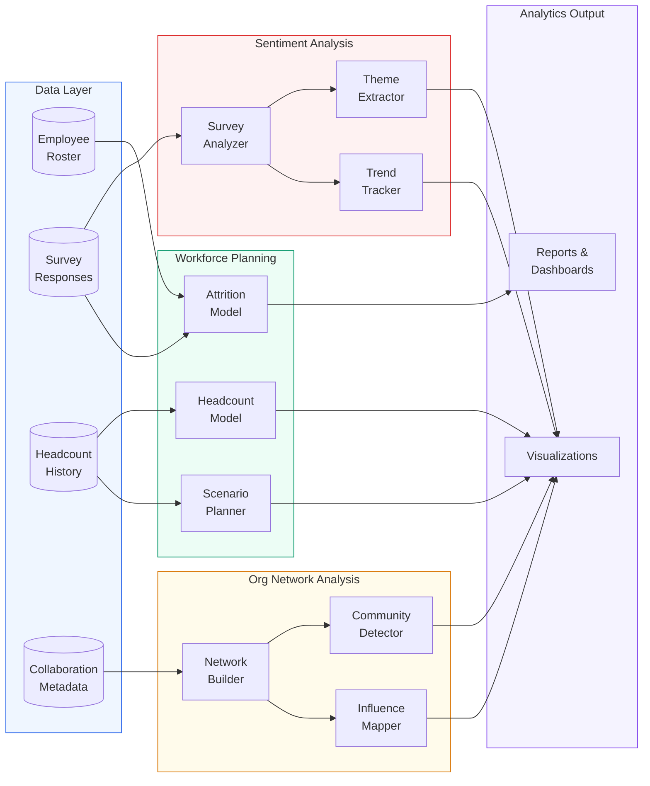
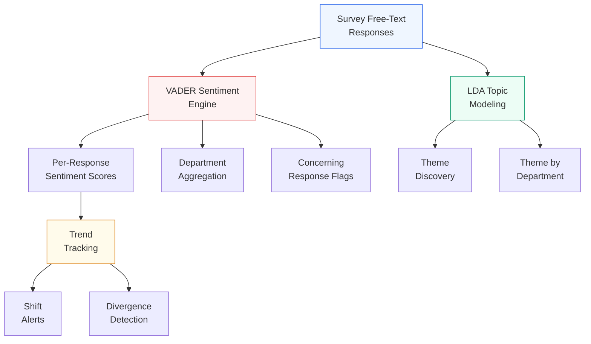
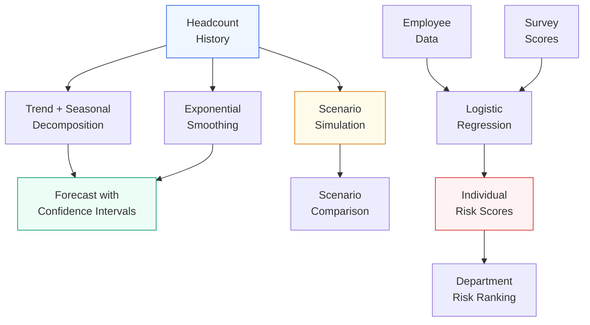
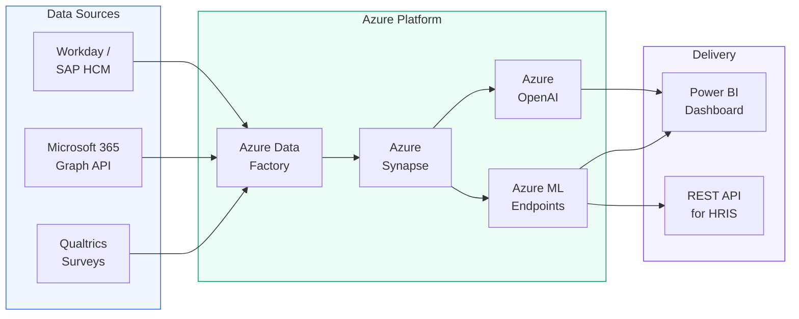

# Architecture Diagrams

## People Analytics Pipeline

```mermaid
graph LR
    subgraph Data["Data Layer"]
        EMP[("Employee<br/>Roster")]
        SRV[("Survey<br/>Responses")]
        HC[("Headcount<br/>History")]
        COL[("Collaboration<br/>Metadata")]
    end

    subgraph Sentiment["Sentiment Analysis"]
        SA["Survey<br/>Analyzer"]
        TE["Theme<br/>Extractor"]
        TT["Trend<br/>Tracker"]
    end

    subgraph Forecasting["Workforce Planning"]
        HM["Headcount<br/>Model"]
        AM["Attrition<br/>Model"]
        SP["Scenario<br/>Planner"]
    end

    subgraph ONA["Org Network Analysis"]
        NB["Network<br/>Builder"]
        CD["Community<br/>Detector"]
        IM["Influence<br/>Mapper"]
    end

    subgraph Output["Analytics Output"]
        VIZ["Visualizations"]
        RPT["Reports &<br/>Dashboards"]
    end

    SRV --> SA
    SA --> TE
    SA --> TT
    HC --> HM
    EMP --> AM
    SRV --> AM
    HC --> SP
    COL --> NB
    NB --> CD
    NB --> IM

    TE --> VIZ
    TT --> VIZ
    HM --> VIZ
    AM --> RPT
    SP --> VIZ
    CD --> VIZ
    IM --> VIZ

    style Data fill:#eff6ff,stroke:#2563eb
    style Sentiment fill:#fef2f2,stroke:#dc2626
    style Forecasting fill:#ecfdf5,stroke:#059669
    style ONA fill:#fffbeb,stroke:#d97706
    style Output fill:#f5f3ff,stroke:#7c3aed
```

## Sentiment Analysis Flow

```mermaid
graph TD
    RAW["Survey Free-Text<br/>Responses"] --> VADER["VADER Sentiment<br/>Engine"]
    RAW --> LDA["LDA Topic<br/>Modeling"]

    VADER --> SCORE["Per-Response<br/>Sentiment Scores"]
    VADER --> AGG["Department<br/>Aggregation"]
    VADER --> FLAG["Concerning<br/>Response Flags"]

    LDA --> THEMES["Theme<br/>Discovery"]
    LDA --> DEPT["Theme by<br/>Department"]

    SCORE --> TREND["Trend<br/>Tracking"]
    TREND --> ALERT["Shift<br/>Alerts"]
    TREND --> DIV["Divergence<br/>Detection"]

    style RAW fill:#eff6ff,stroke:#2563eb
    style VADER fill:#fef2f2,stroke:#dc2626
    style LDA fill:#ecfdf5,stroke:#059669
    style TREND fill:#fffbeb,stroke:#d97706
```

## Forecasting Flow

```mermaid
graph TD
    HC["Headcount<br/>History"] --> TS["Trend + Seasonal<br/>Decomposition"]
    HC --> ES["Exponential<br/>Smoothing"]

    TS --> FC["Forecast with<br/>Confidence Intervals"]
    ES --> FC

    EMP["Employee<br/>Data"] --> LR["Logistic<br/>Regression"]
    SRV["Survey<br/>Scores"] --> LR

    LR --> RISK["Individual<br/>Risk Scores"]
    RISK --> DEPT["Department<br/>Risk Ranking"]

    HC --> SIM["Scenario<br/>Simulation"]
    SIM --> COMP["Scenario<br/>Comparison"]

    style HC fill:#eff6ff,stroke:#2563eb
    style FC fill:#ecfdf5,stroke:#059669
    style RISK fill:#fef2f2,stroke:#dc2626
    style SIM fill:#fffbeb,stroke:#d97706
```

## Azure Production Architecture

```mermaid
graph LR
    subgraph Sources["Data Sources"]
        WD["Workday /<br/>SAP HCM"]
        O365["Microsoft 365<br/>Graph API"]
        QTX["Qualtrics<br/>Surveys"]
    end

    subgraph Azure["Azure Platform"]
        ADF["Azure Data<br/>Factory"]
        SYN["Azure<br/>Synapse"]
        AOAI["Azure<br/>OpenAI"]
        AML["Azure ML<br/>Endpoints"]
    end

    subgraph Output["Delivery"]
        PBI["Power BI<br/>Dashboard"]
        API["REST API<br/>for HRIS"]
    end

    WD --> ADF
    O365 --> ADF
    QTX --> ADF
    ADF --> SYN
    SYN --> AOAI
    SYN --> AML
    AOAI --> PBI
    AML --> PBI
    AML --> API

    style Sources fill:#eff6ff,stroke:#2563eb
    style Azure fill:#ecfdf5,stroke:#059669
    style Output fill:#f5f3ff,stroke:#7c3aed
```
