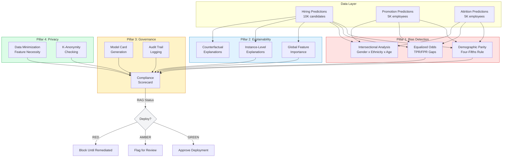
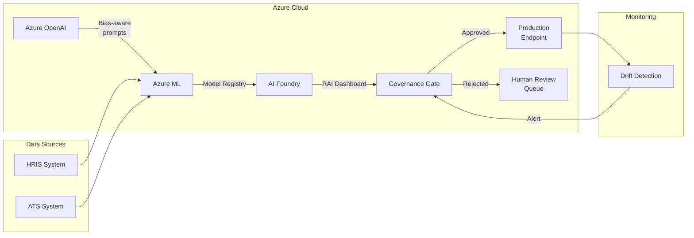

# Responsible AI Framework Architecture

```mermaid
graph TB
    subgraph Data["Data Layer"]
        HP[Hiring Predictions<br/>10K candidates]
        PP[Promotion Predictions<br/>5K employees]
        AP[Attrition Predictions<br/>5K employees]
    end

    subgraph Bias["Pillar 1: Bias Detection"]
        DP[Demographic Parity<br/>Four-Fifths Rule]
        EO[Equalized Odds<br/>TPR/FPR Gaps]
        IA[Intersectional Analysis<br/>Gender x Ethnicity x Age]
    end

    subgraph Explain["Pillar 2: Explainability"]
        GI[Global Feature<br/>Importance]
        LE[Instance-Level<br/>Explanations]
        CF[Counterfactual<br/>Explanations]
    end

    subgraph Govern["Pillar 3: Governance"]
        MC[Model Card<br/>Generation]
        AT[Audit Trail<br/>Logging]
        CR[Compliance<br/>Scorecard]
    end

    subgraph Privacy["Pillar 4: Privacy"]
        DM[Data Minimization<br/>Feature Necessity]
        AN[K-Anonymity<br/>Checking]
    end

    HP --> DP & EO & IA
    PP --> DP & EO & IA
    AP --> DP & EO & IA

    HP --> GI & LE & CF

    DP & EO --> CR
    GI & LE --> CR
    DM & AN --> CR
    MC & AT --> CR

    CR --> |RAG Status| Decision{Deploy?}
    Decision --> |GREEN| Deploy[Approve Deployment]
    Decision --> |AMBER| Review[Flag for Review]
    Decision --> |RED| Block[Block Until Remediated]

    style Bias fill:#fee2e2,stroke:#dc2626
    style Explain fill:#e0f2fe,stroke:#0284c7
    style Govern fill:#fef3c7,stroke:#d97706
    style Privacy fill:#dcfce7,stroke:#16a34a
    style Decision fill:#f3f4f6,stroke:#374151
```

## Production Architecture (Azure)

```mermaid
graph LR
    subgraph Azure["Azure Cloud"]
        AOAI[Azure OpenAI] --> |Bias-aware<br/>prompts| ML[Azure ML]
        ML --> |Model Registry| AIF[AI Foundry]
        AIF --> |RAI Dashboard| GOV[Governance Gate]
        GOV --> |Approved| PROD[Production<br/>Endpoint]
        GOV --> |Rejected| REVIEW[Human Review<br/>Queue]
    end

    subgraph Data["Data Sources"]
        HRIS[HRIS System] --> ML
        ATS[ATS System] --> ML
    end

    subgraph Monitor["Monitoring"]
        PROD --> DRIFT[Drift Detection]
        DRIFT --> |Alert| GOV
    end
```
